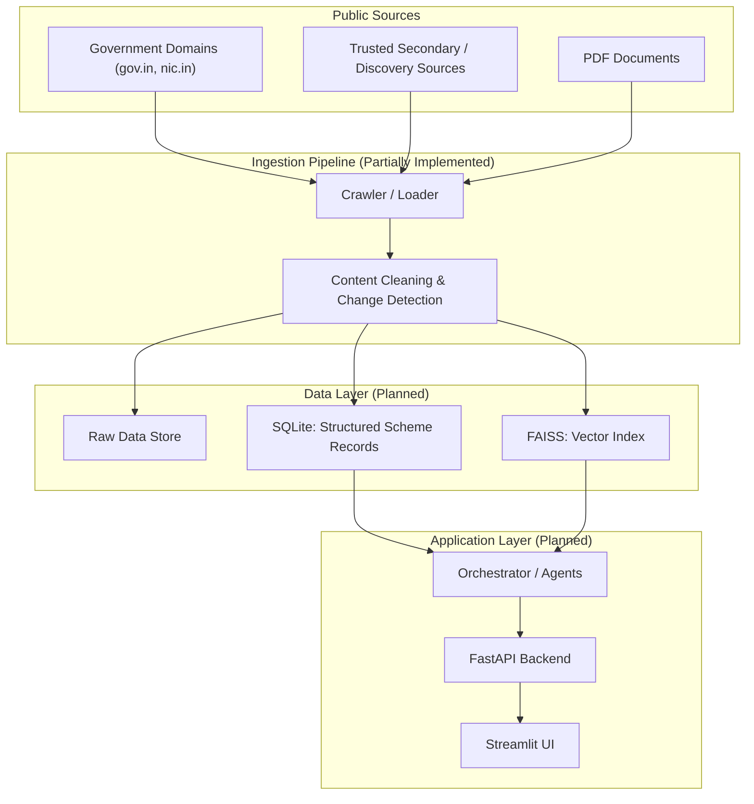
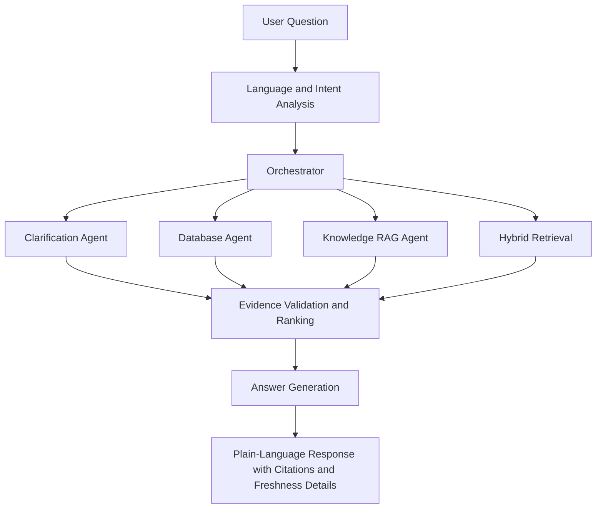
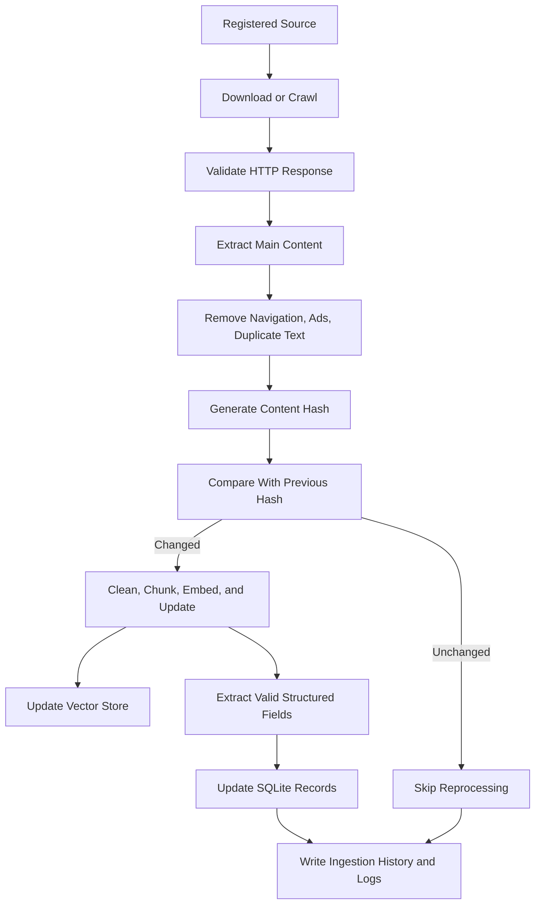

# AgriSubsidyAI

**An agentic hybrid Retrieval-Augmented Generation (RAG) system to help farmers discover and understand agricultural subsidy schemes.**

---

## Status: Initial development

The HTML/PDF ingestion and preprocessing pipeline is implemented and tested.
Vector indexing, structured extraction, retrieval, orchestration, and the
application layers are still under development.

> This is an independent educational project. It is not affiliated with or endorsed by any government department.

---

## ⚠️ Important Disclaimer

AgriSubsidyAI is a **personal learning and portfolio project**. It is designed to help farmers and researchers explore publicly available information about agricultural subsidy schemes in an easier, conversational format.

- This system **does not** determine, guarantee, or certify eligibility for any scheme.
- This system **is not** an official government service and has **no official government affiliation or endorsement**.
- All answers are grounded in cited sources, but sources may be incomplete, outdated, or third-party in nature.
- **Final eligibility, application status, and approval must always be verified with the responsible government department.**

---

## What Is Implemented

- HTML crawling with removal of common page chrome and preservation of heading-based sections
- Text-based PDF extraction with page and heading metadata
- Unicode, whitespace, boilerplate, duplicate-line, and null-character cleanup
- Layout-aware chunking with tokenizer-aware recursive fallback
- Shared chunking configuration for tokenizer, limits, overlap, and validation
- Deterministic chunk-quality checks and embedding-ready output
- Manual inspection samples for representative chunks
- Unit tests for fetching, cleaning, extraction, chunking, and validation

## Current Focus

The next stages are embedding generation, FAISS indexing, structured scheme
extraction, retrieval evaluation, and the application layer.

---

## Project Overview

Agricultural subsidy information in India (and similar contexts) is often published across many disconnected webpages, notifications, FAQs, and — eventually — PDF documents, using varying formats, terminology, and languages. Farmers frequently do not have the time, technical familiarity, or language support needed to search, cross-reference, and interpret these sources.

AgriSubsidyAI aims to be a **RAG-based conversational assistant** that:

- Collects information from trusted public sources
- Detects when source content changes
- Builds structured (database) and unstructured (vector) knowledge stores from that content
- Uses an agentic orchestrator to route farmer questions to the right retrieval strategy
- Explains potentially relevant schemes in plain, cited, multilingual language

This is a **learning project** built to practice real-world RAG system design, agent orchestration, hybrid retrieval, and responsible AI patterns — not a production government tool.

---

## Problem Statement

- Scheme information is scattered across many government and non-government webpages.
- Terminology is often legal/bureaucratic and hard for a layperson to parse.
- Farmers may not find information in their preferred language.
- There is no single, farmer-friendly conversational interface that cites its sources and clearly separates "official" from "secondary" information.
- Existing search tools do not track when scheme information has changed or become outdated.

---

## Project Objectives

- Practice building an **agentic, hybrid RAG** architecture (structured + unstructured retrieval).
- Build a **source-aware ingestion pipeline** with change detection and freshness metadata.
- Design an **orchestrator** capable of routing between database search, knowledge search, hybrid search, and clarification.
- Apply **no-hallucination and grounded-answer principles** throughout the system.
- Explore **multilingual query and response handling** as a planned capability.
- Produce a well-documented, portfolio-quality open-source project.

---

## Current Status

**What exists today:** a working initial ingestion and preprocessing pipeline for
HTML and PDF sources, together with unit tests and deterministic chunk-quality
evaluation.

**What does NOT exist yet:**

- No production deployment
- No completed end-to-end ingestion-to-vector-search pipeline
- No populated database or vector index
- No tested language support
- No retrieval or answer-quality evaluation results
- No government partnerships or endorsements
- No live demo

Anything not explicitly listed under "Current Status" should be assumed to be
**planned, not built**.

### Implemented ingestion capabilities

- Crawls configured HTML sources and removes common page chrome such as scripts,
  navigation, headers, and footers.
- Preserves HTML heading-based sections in fetched JSON documents.
- Extracts text from text-based PDFs with page numbers and detected headings.
- Normalizes Unicode and whitespace, removes known source boilerplate, removes
  repeated lines, and removes null characters from extracted text.
- Discovers supported `.json`, `.html`, and `.pdf` files recursively from the
  configured input directory.
- Uses one `ChunkingConfig` for tokenizer, token limit, chunk size, overlap,
  and validation thresholds.
- Uses layout-aware section chunking with tokenizer-aware recursive fallback.
- Preserves source URL/path, title, section, page number, chunk index, hashes,
  word count, and model-token count.
- Writes the full chunk set, an embedding-ready chunk set, a quality report, and
  an evenly distributed manual inspection sample.

---

## Planned Capabilities

> All items below are **planned**, not implemented, unless noted otherwise.

- Ingest public agriculture scheme webpages and track content freshness
- Extract structured scheme fields into a local database
- Build a searchable vector index of unstructured scheme content
- Route farmer questions through an agentic orchestrator
- Support hybrid (keyword + semantic, structured + unstructured) retrieval
- Ask clarification questions when key farmer details are missing
- Generate grounded, cited, plain-language answers
- Support multiple Indian languages (languages to be confirmed after testing)
- Disclose conflicting or outdated source information
- Provide a simple chat-style UI (Streamlit) backed by an API (FastAPI)

---

## High-Level Architecture



---

## Query and Orchestration Flow



### Orchestrator Responsibilities (Planned)

The orchestrator is intended to analyze:

- User intent
- User language
- Conversation context
- Available farmer information (state, district, farming activity, etc.)
- Missing information
- Required retrieval path

Based on this analysis, it should select one route:

| Route | Purpose |
|---|---|
| `database` | Deterministic filtering of structured scheme fields |
| `knowledge` | Semantic/document search for explanations and details |
| `hybrid` | Combination of structured filtering and knowledge search |
| `clarification` | Ask the farmer for missing information |
| `unsupported` | Question is outside scope (e.g., unrelated topic) |

---

## Retrieval Route Examples

> These are illustrative design examples, not logged outputs from a working system.

**Example 1 — Database route**
- Question: *"List irrigation subsidy schemes available in Karnataka."*
- Reasoning: This is a structured filter (category + state), answerable from scheme records.
- Route: `database`

**Example 2 — Knowledge route**
- Question: *"Explain this subsidy in simple language."*
- Reasoning: Requires unstructured explanation from scheme description text.
- Route: `knowledge`

**Example 3 — Hybrid route**
- Question: *"Which schemes apply to a small farmer in Karnataka, and what documents do I need?"*
- Reasoning: Needs structured filtering (state, farmer category) **and** unstructured detail (document requirements).
- Route: `hybrid`

**Example 4 — Clarification route**
- Question: *"Am I eligible for a subsidy?"*
- Reasoning: No state, farming activity, or category provided — insufficient information to retrieve anything meaningful.
- Route: `clarification`

---

## Hybrid Search Explanation

AgriSubsidyAI is planned to implement hybrid retrieval at **two levels**.

### Level 1 — Search Hybridization

- **Keyword search** for exact scheme names, identifiers, and domain-specific terms
- **Vector search** for semantic and natural-language similarity
- **Ranking or reranking** of combined keyword and vector results

### Level 2 — Data-Source Hybridization

- **SQLite search** for deterministic, structured filtering (state, category, farmer type, etc.)
- **RAG knowledge search** for explanations, eligibility nuances, and detailed conditions
- **Combined evidence** when a question requires both structured filters and unstructured explanation

---

## Data Ingestion and Freshness Flow



Change detection confirms only whether **downloaded content has changed since the last successful crawl**. It does **not** and cannot guarantee that a publisher or government body has kept the underlying information correct, complete, or current.

---

## Source Trust and Verification Model

- **Government domains** (e.g., `gov.in`, `nic.in`) are treated as **primary sources**.
- **Trusted public or third-party websites** (e.g., `schemesinindia.in`) are treated as **secondary discovery sources** — useful for finding schemes, but not authoritative for final eligibility.
- Secondary-source eligibility details should, wherever possible, be **cross-verified against an official source** before being presented with confidence.
- **No source is labeled "trusted" or "official" unless its status has been explicitly verified.**
- Every indexed source is planned to record:
  - Source URL
  - Publisher type (government / secondary / unknown)
  - Date last checked
  - Freshness / change-detection metadata

Text-based PDF ingestion is implemented. OCR for scanned/image-only PDFs and
additional document types remain future work.

---

## Raw, Processed, Structured, and Vector Data Layers

| Layer | Contents | Purpose |
|---|---|---|
| **Raw data** | Original downloaded HTML / source documents | Auditing, debugging, reprocessing |
| **Processed data** | Cleaned content, structure-aware chunks, metadata, and quality reports | Input to embedding and extraction steps |
| **Structured data** | Validated scheme fields in SQLite | Deterministic filtering and lookups |
| **Vector data** | Embeddings + metadata in FAISS | Semantic search over unstructured content |
| **Ingestion metadata** | Source URL, HTTP status, last-checked date, content hash, change-detection status, ingestion result | Freshness tracking and pipeline observability |

---

## Planned Repository Structure

```
AgriSubsidyAI-RAG/
├── README.md
├── requirements.txt
├── .env.example
├── LICENSE
├── .gitignore
├── config/            # Environment, model provider, and app configuration
├── docs/              # Additional design docs, diagrams, notes
├── data/
│   ├── raw/           # Original downloaded source content
│   ├── processed/     # Cleaned & chunked content with metadata
│   ├── database/      # SQLite database file(s)
│   ├── vectorstore/   # FAISS index files
│   └── metadata/      # Ingestion history, source registry, hashes
├── ingestion/         # Crawling, cleaning, change detection, extraction
├── agents/            # Orchestrator, clarification, database, RAG agents
├── retrieval/         # Keyword, vector, hybrid retrieval, ranking logic
├── database/          # SQLite schema, models, and query helpers
├── models/            # Embedding / LLM provider abstractions
├── services/          # Shared business logic (source registry, validation, etc.)
├── api/               # FastAPI backend
├── ui/                # Streamlit frontend
├── scripts/           # One-off / maintenance scripts (e.g., manual ingestion runs)
├── logs/              # Structured application and ingestion logs
└── tests/
    ├── unit/          # Unit tests
    ├── integration/   # Integration tests across modules
    └── evaluation/    # Retrieval and answer-quality evaluation scripts
```

**Note:** Generated data, SQLite databases, FAISS indexes, raw downloaded webpages, log files, caches, and secrets (`.env`) are expected to be excluded from Git via `.gitignore`.

---

## Technology Stack

> Components below are either implemented in preprocessing or planned for later phases.

- **Python** — primary language
- **FastAPI** — backend API layer
- **Streamlit** — initial UI layer
- **SQLite** — structured scheme storage (local-first, personal project)
- **FAISS** — local vector store
- **BeautifulSoup** — HTML parsing
- **pypdf** — text-based PDF extraction
- **Hugging Face Transformers** — tokenizer-aware chunk sizing
- **Requests / an appropriate webpage loader** — content fetching
- **Embedding model** — configurable via environment settings (provider not fixed)
- **LLM provider** — configurable via environment settings (provider not fixed)
- **Pytest** — testing framework
- **Structured logging** — for ingestion and application observability

The architecture is intentionally **not locked to a single commercial LLM or embedding provider**.

---

## Configuration Approach

Configuration is planned to be handled through environment variables (see `.env.example`), including:

- LLM provider and model name
- Embedding provider and model name
- Database and vector store paths
- Source registry location
- Logging level

The preprocessing stage uses `EMBEDDING_MODEL`, with a multilingual
Sentence Transformers model as the default. In VS Code, select
`AgriSubsidyAI-RAG/venv/Scripts/python.exe` on Windows so installed packages
such as `pypdf` and `transformers` resolve correctly.

---

## Local Setup Instructions

> The ingestion and preprocessing steps below are available now. API and UI
> commands will be added as those layers are implemented.

1. Clone the repository:
   ```bash
   git clone <your-repository-url>
   cd AgriSubsidyAI-RAG
   ```
2. Create and activate a virtual environment:
   ```bash
   python -m venv venv
   source venv/bin/activate  # Windows: venv\Scripts\activate
   ```
3. Install dependencies:
   ```bash
   pip install -r requirements.txt
   ```
4. Copy `.env.example` to `.env` and fill in configuration values:
   ```bash
   cp .env.example .env
   ```
5. Run the preprocessing stage before adding chunks to an embedding index:
   ```bash
   python -m ingestion.process
   ```
   The processor uses HTML headings and PDF page/heading boundaries where
   available. Oversized sections use structure-aware, sentence-preserving
   token-based packing while retaining the section and PDF page metadata.
   Scanned/image-only PDFs
   require OCR before processing. This writes `data/processed/chunks.jsonl`, a quality report, and
   `data/processed/chunks_ready.jsonl`. Use the ready file as the sole input
   to embedding; chunks that fail deterministic checks (missing metadata,
   empty/short text, duplicate text, or excessive token length) remain in the
   full file for inspection but are excluded from the ready file.
   Explicit question headings (for example, `Who is eligible?`) preserve their
   short answers. The processor also writes `chunk_inspection.jsonl` with up to
   25 evenly distributed chunks for manual review.
6. FastAPI and Streamlit commands will be documented when those layers are implemented.

To build the local vector index, embed the validated chunks file only:

```bash
python -m scripts.embed
```

The command reads `data/processed/chunks_ready.jsonl` and rejects other input
filenames. It writes the FAISS index, provenance metadata, and an embedding
manifest under `data/vectorstore/`.

---

## Preprocessing Observations From Current Data

Manual inspection of 25 evenly distributed representative chunks identified the following
patterns:

- Many source pages combine scheme summaries, eligibility, documents, and
  application instructions in one long page.
- Some pages contain promotional/share widgets and malformed WhatsApp URL text;
  these are removed or prevented from becoming FAQ headings.
- Some PDF extraction output contains null characters or damaged characters;
  null characters are removed, but OCR is still needed for image-only content.
- Not every PDF exposes reliable headings, so page boundaries remain the
  fallback structure.
- FAQ pages often contain multiple questions and answers in one extracted
  section; a future parser can split these into question-answer pairs.
- The current run generated 180 chunks, including 49 question-heading chunks,
  with no invalid chunks under the configured checks.
- Short FAQ preservation is intentionally limited to sections with an explicit
  question heading; short non-FAQ content remains subject to the minimum-word
  check.
- Chunk inspection showed that source cleanup and layout detection should be
  revisited whenever a new publisher or page template is added.

These observations describe the current sample and should not be interpreted
as general accuracy or completeness guarantees.

---

## Retrieval Evaluation Set

`evaluation/retrieval_eval.json` contains a small, versioned set of eight
representative queries. Each case records the expected source URL, evidence
terms, and query category. Run the quick corpus check with:

```bash
python -m evaluation.retrieval_eval
```

It reports:

- `source_url_coverage`: percentage of cases whose expected source exists in
  `chunks_ready.jsonl`.
- `evidence_case_coverage`: percentage of cases with at least one chunk from
  the expected source containing every required evidence term.
- Average source and evidence chunk counts per case.

The current corpus check reports **8 cases, 180 chunks, 100% source URL
coverage, and 100% evidence-case coverage**. These are corpus-coverage
metrics, not semantic retrieval recall. After a vector index exists, the same
cases should be evaluated against top-k results to report Recall@k, MRR, and
evidence coverage of retrieved context. The set intentionally covers benefits,
eligibility, documents, application guidance, and official-portal questions;
it is a smoke test, not a statistically representative accuracy benchmark.

---

## Example Questions

- "Which agricultural subsidy schemes may apply to me?"
- "Are there any irrigation subsidies for small farmers in Karnataka?"
- "What documents are required for a particular scheme?"
- "How can I apply for the scheme?"
- "Explain this subsidy in simple language."
- "Compare two agricultural schemes."
- "Answer in my preferred language."

If key details are missing, the system is designed to ask about:

- State
- District
- Farming activity
- Landholding size
- Farmer category
- Type of support required

---

## Expected Response Format (Planned)

A typical response is intended to include:

- A plain-language explanation of the relevant scheme(s)
- Source citations (URL, publisher type, date last checked)
- A note on data freshness
- A disclosure of conflicting information, if any exists
- A clear grounding statement, for example:

> "Based on the cited information, you may meet some of the listed conditions. Final eligibility and approval must be confirmed through the responsible government department."

---

## No-Hallucination and Safety Principles

- Answers must be **grounded in retrieved evidence** — not model assumptions.
- Every scheme recommendation should include **source references**.
- The system **must not guarantee eligibility**.
- **Missing information should trigger clarification questions**, not guesses.
- **Conflicting sources must be disclosed**, not silently resolved.
- **Official sources are prioritized** over secondary sources.
- **Secondary sources are clearly labeled** as such.
- **Missing database fields must never be generated or inferred by the LLM** — they remain `null`/`unknown`.
- The system should explicitly say when reliable information is unavailable.
- **Final approval always remains with the responsible government authority.**
- AgriSubsidyAI is an **educational assistant**, not an official government service.

---

## Testing and Evaluation Strategy

The preprocessing stage performs deterministic checks for empty text, missing
metadata, duplicate content, short non-FAQ chunks, and chunks above the
embedding model token limit. Explicit question headings preserve short FAQ
answers. It also writes up to 25 evenly distributed chunks to
`data/processed/chunk_inspection.jsonl` for manual review.

A representative run over the current PDF collection produced 181 chunks:
all 181 passed the implemented preprocessing checks. This is a preprocessing
quality result, not a retrieval or answer-accuracy result.

The broader planned evaluation strategy covers:

- Router decision accuracy (correct route selected for a given question)
- Retrieval relevance (structured and vector search)
- Citation correctness (citations match retrieved evidence)
- Answer faithfulness (no unsupported claims)
- Missing-information detection (clarification triggered appropriately)
- Conflicting-source handling (disclosure behavior)
- Multilingual query quality (once languages are tested)
- Database extraction validation (structured field accuracy)
- Website-change detection accuracy
- End-to-end integration tests across the full pipeline

Retrieval relevance, citation correctness, answer faithfulness, routing,
multilingual quality, and end-to-end evaluation results do not exist yet.

---

## Development Roadmap

### Phase 1 — Foundations
- [x] Repository foundation
- [x] Configuration system
- [ ] Source registry
- [x] Structured logging setup
- [x] Basic webpage ingestion

### Phase 2 — Knowledge Pipeline
- [x] Content cleaning
- [x] Metadata extraction
- [x] Chunking strategy
- [x] Pre-embedding chunk quality evaluation
- [x] Embedding generation
- [x] FAISS vector index
- [ ] Source citation tracking

### Phase 3 — Structured Data
- [ ] SQLite schema design
- [ ] Structured scheme extraction
- [ ] Validation workflow
- [ ] Database retrieval logic

### Phase 4 — Orchestration
- [ ] Orchestrator core logic
- [ ] Language and intent analysis
- [ ] Clarification logic
- [ ] Database route
- [ ] Knowledge route
- [ ] Hybrid route

### Phase 5 — Application Layer
- [ ] Streamlit interface
- [ ] FastAPI backend
- [ ] Conversation context handling
- [ ] Multilingual testing

### Phase 6 — Evaluation and Polish
- [ ] Retrieval evaluation
- [ ] Answer-grounding tests
- [ ] Source freshness monitoring
- [ ] Error handling
- [ ] Documentation and screenshots

---

## Known Limitations

- The project is in an early architecture and development stage; most components are not yet built.
- No performance, accuracy, or coverage statistics exist yet.
- No languages have been tested for multilingual support.
- PDF extraction currently targets text-based PDFs; scanned/image-only PDFs
  require OCR.
- PDF heading detection is heuristic and may need adjustment when publishers
  change layout or typography.
- HTML pages with unusual layouts may produce weak section boundaries.
- Source pages may contain stale, malformed, duplicated, or promotional text.
- Cleaning rules are currently source-aware and should be reviewed when new
  publishers are added.
- The inspection file is a sample and is not a substitute for full-document
  review.
- Secondary-source information may be incomplete, outdated, or inaccurate.
- Change detection confirms content changes but cannot verify factual correctness of source content.
- No government partnership, endorsement, or data-sharing agreement exists.

---

## Responsible-Use Disclaimer

AgriSubsidyAI is an **educational, portfolio-oriented project**. It is not a substitute for official government guidance. Users should always:

- Verify scheme details directly with the relevant government department
- Treat AI-generated explanations as a **starting point**, not a final answer
- Understand that eligibility, deadlines, and application procedures can change without notice

---

## Contributing

This is currently a personal learning project. Contribution guidelines will be added as the architecture stabilizes.

---

## License

This project is licensed under the terms in [LICENSE](LICENSE).

---

## Project Links and Assets

- GitHub repository: To be added
- Application screenshot: To be added
- Architecture image: See the diagrams in this README
- Demo URL: Not available yet
- Tested languages: Not evaluated yet
- LLM provider: Not selected yet
- Embedding model: `sentence-transformers/paraphrase-multilingual-MiniLM-L12-v2`
- Contact information: To be added
